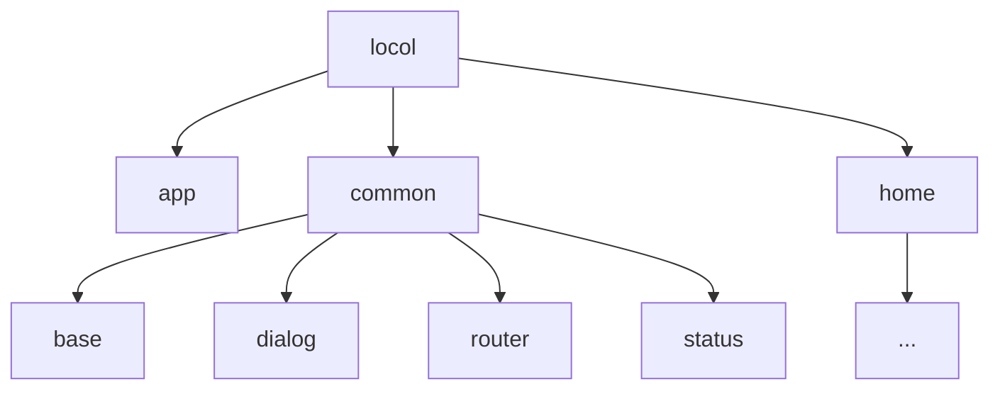

# locol是一个基于kotlin+mvvm 组件化开发的项目
###########环境依赖
gradle-7.5
###########目录结构描述

- [x]路由配置
- [ ]base开发
- [x]baseActviity
- [ ]baseFragment
- [ ]baseViewmodel
- [ ]baseModel
- [ ]网络框架
- [ ]业务逻辑
- [ ]主页开发
- [ ]功能页开发
- [ ]我的页面
